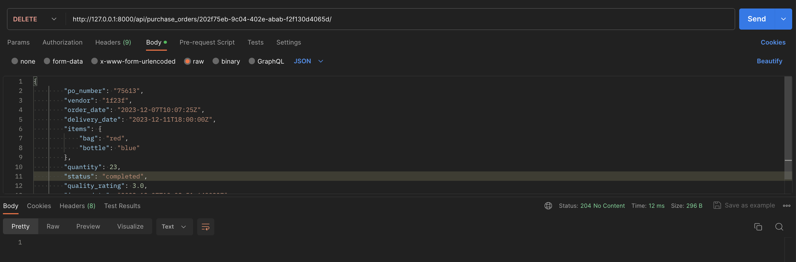

# List all purchase orders

Endpoint: `GET /api/orders/`

Description: Retrieves a list of all purchase orders

# Create a new  purchase orders

Endpoint: `POST /api/orders/`

Description: Creates a new purchase orders.

# Update a  purchase orders

Endpoint: `PUT /api/orders/{pk}/`

Description: Updates details of a specific purchase orders identified by the primary key.

# Retrieve a  purchase orders

Endpoint: `GET /api/orders/{pk}/`

Description: Retrieves details of a specific purchase orders identified by the primary key.

# Delete a  purchase orders

Endpoint: `DELETE /api/orders/{pk}/`

Description: Deletes a specific purchase orders identified by the primary key.

#  purchase orders acknowledgement

Endpoint: `GET /api/orders/{pk}/acknowledge/`

Acknowledges the purchase order issues to vendor

