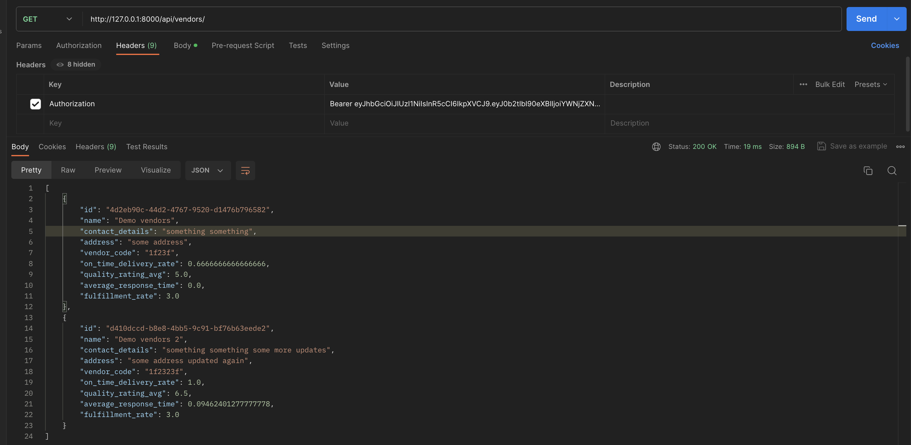

# List all vendors

Endpoint: `GET /api/vendors/`

Description: Retrieves a list of all vendors

# Create a new vendor

Endpoint: `POST /api/vendors/`

Description: Creates a new vendor.

# Update a vendor

Endpoint: `PUT /api/vendors/{pk}/`

Description: Updates details of a specific vendor identified by the primary key.

# Retrieve a vendor

Endpoint: `GET /api/vendors/{pk}/`

Description: Retrieves details of a specific vendor identified by the primary key.

# Delete a vendor

Endpoint: `DELETE /api/vendors/{pk}/`

Description: Deletes a specific vendor identified by the primary key.

# Vendor Performance Records

Endpoint: `GET /api/vendors/{pk}/performance/`

Description: Returns performance records for a specific vendor.

